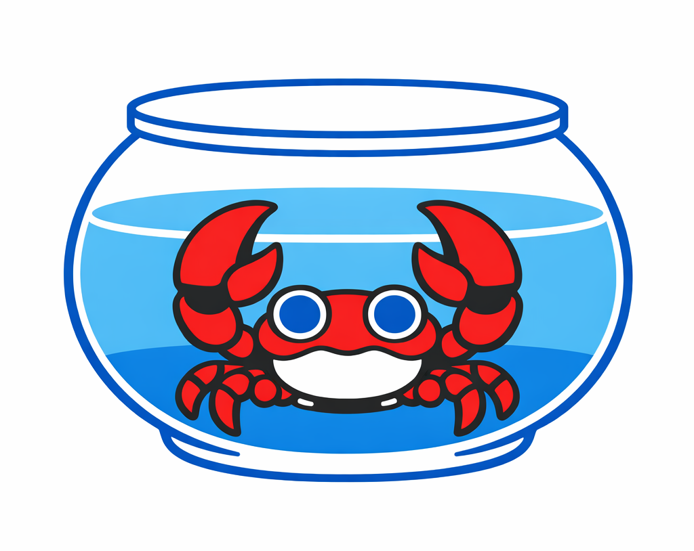

# vmClaw 🦀

<p align="center">
<strong>Don't share your pool with your Claws.<br>
Give each AI employee its own identity and digital workspace.<br>
You run the fleet like a boss.</strong>
</p>

<p align="center">
  
</p>

vmClaw captures your VM screen, sends it to an AI vision model, and executes the actions it decides on — clicks, typing, keyboard shortcuts, scrolling — in a continuous loop until the task is done.

> Imagine running a company staffed by AI employees. Each one has a unique identity and works inside its own VM, giving every agent a clean, isolated workspace that never touches your host system. From your host machine, you act as the boss—assigning tasks, supervising their work, and interacting with each employee separately—while keeping your personal identity and environment fully isolated from the identities of your AI workforce.

<!-- TODO: Replace with actual demo GIF -->
<!--  -->

## Why vmClaw?

- **Multi-model** — GPT-5.4, Claude Opus 4.6, GPT-4o, DeepSeek, Grok, and 15+ more models.
- **Local** — Runs on your Windows machine. Screenshots never leave your network (sent directly to the AI API).
- **Universal** — Supports Hyper-V, VMware, VirtualBox, and QEMU VMs.
- **AI Memory** — Stores past task executions in a local vector database and recalls similar successes as few-shot examples, so it improves with every run. All memory stays on your machine — nothing is shared or uploaded.
- **Simple** — One command to start. No complex setup.

## Fleet Mode — Control All Your VMs From One Screen

<p align="center">
  
</p>

What if one AI agent isn't enough? **Fleet mode** lets you command VMs across every machine on your network from a single GUI.

```
  ┌──────────────────────────────────────────────────────┐
  │              Your Machine (Hub)                       │
  │   vmClaw GUI  ──────────────────────────────────────  │
  │   ┌──────────────┐  ┌────────────┐  ┌────────────┐  │
  │   │ VM: Alice     │  │ VM: Bob    │  │ VM: Carol  │  │
  │   │ (local)       │  │ (local)    │  │ (local)    │  │
  │   └──────────────┘  └────────────┘  └────────────┘  │
  └──────────────┬───────────────────────────────────────┘
                 │  WebSocket
        ┌────────┴────────┐
        │  Lab Server      │         ┌──────────────────┐
        │  10.0.0.9        │─────────│  More machines   │
        │  ┌────────────┐  │         │  ...             │
        │  │ VM: Dev-01  │  │         └──────────────────┘
        │  │ VM: Dev-02  │  │
        │  │ VM: Dev-03  │  │
        │  └────────────┘  │
        └──────────────────┘
```

- **One click, any VM** — Browse VMs across all machines in a sidebar tree. Click one, assign a task, watch it execute in real-time.
- **Live streaming** — Screenshots, logs, and actions from remote nodes stream back over WebSocket instantly. It feels like the VM is running locally.
- **Zero config discovery** — Just add a peer's IP to `config.toml`. No VPN, no cloud, no port forwarding gymnastics. It works on your LAN out of the box.
- **Scale your AI workforce** — Run 3 VMs on your desktop, 5 on a lab server, 10 in a rack. Assign tasks to any of them from one place. Each AI employee works independently inside its own VM.
- **Proxy chains** — Node A discovers Node B's peers automatically, so `A -> B -> C` routing works without configuring every node.

```toml
# config.toml — that's all you need
[fleet]
enabled = true
node_name = "my-pc"
listen_port = 8077

[[fleet.peers]]
name = "lab-server"
url = "http://192.168.1.50:8077"
```

Fleet turns vmClaw from a single-machine tool into a **distributed AI operations center**. Think Ansible, but instead of running shell commands, your agents *see the screen and use it like a human would*.

## Quick Start

```bash
# Install
.\.venv\Scripts\pip.exe install -e .

# Run as Administrator (required to inject input into VM windows)
.\.venv\Scripts\python.exe -m vmclaw run

# Or launch the GUI
.\.venv\Scripts\python.exe -m vmclaw gui
```

That's it. vmClaw will walk you through selecting a provider, model, and VM window interactively.

## How It Works

```
┌─────────────┐     ┌─────────────┐     ┌─────────────┐
│  Capture VM  │────>│  AI Vision   │────>│  Execute     │
│  Screenshot  │     │  Model       │     │  Action      │
└─────────────┘     └─────────────┘     └─────────────┘
       ^                                        │
       └────────────────────────────────────────┘
                    repeat until done
```

1. **Capture** — Takes a screenshot of the selected VM window
2. **Think** — Sends the screenshot + task description to an AI vision model
3. **Act** — Executes the AI's decision (click, type, key press, scroll)
4. **Repeat** — Loops until the AI reports the task is done (or hits the action limit)

## Supported Models

| Provider | Models | Auth |
|----------|--------|------|
| **GitHub Copilot** (free) | Claude Opus 4.6, Claude Sonnet 4.6, GPT-5.4, GPT-5-mini, GPT-4o, GPT-4.1, o3, o4-mini, DeepSeek-R1, Grok-3, and more | `gh auth login` (browser) |
| **OpenAI** (API key) | GPT-4o, GPT-4.1, o3, o4-mini, and any OpenAI model | `OPENAI_API_KEY` env var |

## Commands

```bash
python -m vmclaw run         # Start the AI agent loop (CLI)
python -m vmclaw gui         # Launch the graphical interface
python -m vmclaw list        # List detected VM windows
python -m vmclaw list-all    # List all windows (for debugging)
python -m vmclaw capture     # Capture a VM screenshot
```

## Requirements

- **Windows 10/11** with Python 3.10+
- A running VM (Hyper-V, VMware, VirtualBox, or QEMU)
- GitHub CLI (`gh`) for GitHub Copilot auth, or an OpenAI API key

## Configuration

vmClaw works out of the box with interactive prompts. For automation, create a `config.toml`:

```toml
[api]
provider = "github"    # or "openai"
model = "claude-opus-4.6"

[agent]
max_actions = 50       # Safety limit
action_delay = 1.0     # Seconds between actions
screenshot_width = 1024
```

## How to Contribute

- Run VS Code with Administrator

## License

MIT
